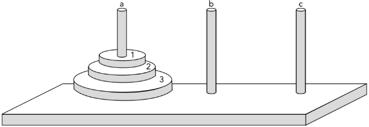

# Capítulo 1 - Introdução à lógica de programação

> O primeiro capítulo do livro vai da página 1 à 18. Se você ainda não adquiriu, neste [link](https://books.google.com.br/books?id=SBRtEAAAQBAJ&pg=PA1&hl=pt-BR&source=gbs_toc_r&cad=2#v=onepage&q&f=false) é possível ler todo o capítulo exceto as páginas 17 e 18.

## Exercício de fixação 1 - pág 12

### 1.1 Três senhoras

Três senhoras - dona Branca, dona Rosa e dona Violeta - passeavam pelo parque quando dona Rosa disse:

- Não é curioso que estejamos usando vestidos de cores branca, rosa e violeta embora nenhuma de nós esteja usando um vestido de cor igual ao seu próprio nome?
- Uma simples coincidência - respondeu a senhora com o vestido violeta.

**Qual a cor do vestido de cada senhora?**

### 1.2 Travessia do rio

Um homem precisa atravessar um rio com um barco que possui capacidade apenas para carregar ele mesmo e mais uma de suas três cargas, que são:

- um lobo 🐺
- um bode 🐐
- um maço de alfafa 🥬

**O que o homem deve fazer para conseguir atravessar o rio sem perder suas cargas?**

Escreva um algoritmo mostrando a resposta, ou seja, indicando todas as ações necessárias para efetuar uma travessia segura.

### 1.3 Torre de Hanói

Elabore um algoritmo que mova três discos de uma Torre de Hanói, que consiste em três hastes (a - b - c), uma das quais serve de suporte para três discos de tamanhos diferentes (1 - 2 - 3), os menores sobre os maiores.

Pode-se mover um disco de cada vez para qualquer haste, contanto que nunca seja colocado um disco maior sobre um menor. O objetivo é transferir os três discos para outra haste.

### 1.4 Três jesuítas e três canibais

Três jesuítas e três canibais precisam atravessar um rio; para tal, dispõem de um barco com capacidade para duas pessoas.
Por medida de segurança, não se deve permitir que em alguma margem a quantidade de jesuítas seja inferior à de canibais.

**Qual a solução para efetuar a travessia com segurança?**

Elabore um algoritmo mostrando a resposta, indicando as ações que concretizam a solução desse problema.
